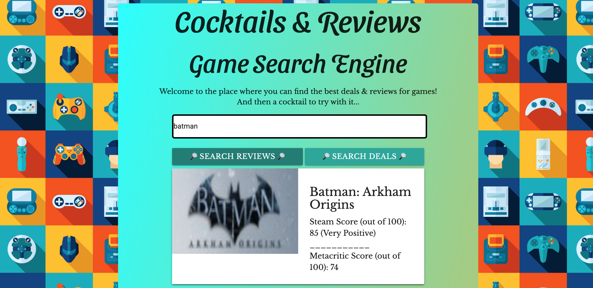
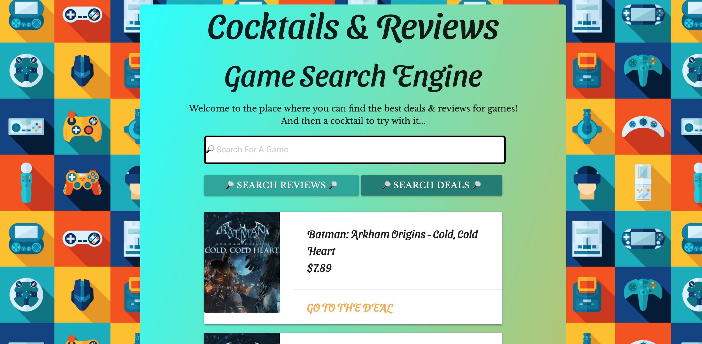
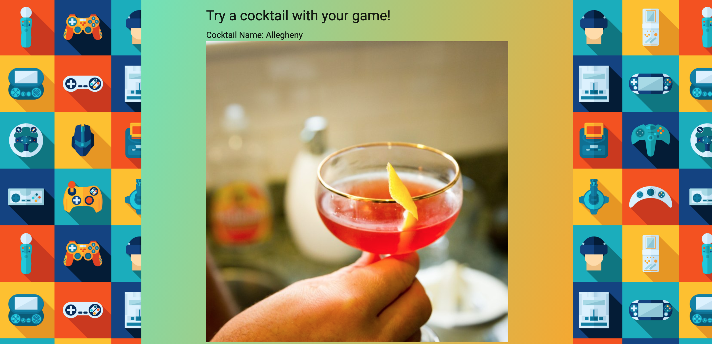

# Cocktails and Reviews - PC Game Search Engine

The project is aimed at using Cheapshark's API to look at deals on digital games, and the API from The Cocktail DB API to suggest cocktails to go with game. The word user types to find deals are also stored using local storage and displayed for easy re-searching capability.

Our MVP has following criteria:
    - Use at least 2 different server-side API's
    - Use css framework other than Bootstrap
    - No alerts, prompts, or confirm windows
    - Implement client-side storage to store persistent data
    - Have a mobile-first UI
    
### Technologies Used
* HTML, CSS, JS
* jQuery
* Cheapshark API
* Cocktail DB API
* Materialize CSS
* Google Fonts

### Screenshots

### Links

Deployed Link: https://umutamac.github.io/Game-Search-Engine/

Github Repository: https://github.com/umutamac/Game-Search-Engine

### Contributors
Umut A. https://github.com/umutamac
email: amacalptekin@gmail.com

Justin T. https://github.com/JuTo-Hub
email: justintorres1@outlook.com

Julian R. https://github.com/julianriverajr
email: julianriverajr@gmail.com
